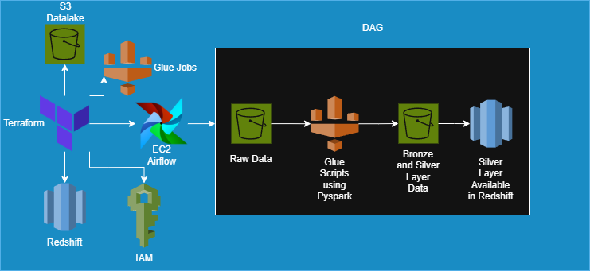

# Shape FPSO Equipment Failure Pipeline

This project implements a complete data pipeline that ingests, processes, and analyzes equipment sensor failure data for an FPSO scenario, using AWS services like Glue, S3, Redshift Serverless, and EC2-hosted Airflow. The DAG handles ingestion from raw files to a curated Silver table and enables analytical queries via Redshift.

## Diagram
```html
<p align="center">
  
</p>
```

## Architecture Overview

- **Data Storage:** S3 (raw, bronze, silver layers)
- **ETL Processing:** AWS Glue Jobs
- **Data Warehouse:** Amazon Redshift Serverless
- **Orchestration:** Apache Airflow running on EC2 (with SSH/UI access)
- **Infrastructure as Code:** Terraform

## Setup Instructions

### 1. Infrastructure Provisioning

Provision all infrastructure using Terraform:

```bash
cd terraform/
terraform init
terraform apply
```

### 2. Pre-DAG Execution Steps

Before running the Airflow DAG, perform the following:

- Associate the **IAM Role** to the Redshift Workgroup (under **Workgroup > Permissions**)
- Create **admin credentials** for Redshift and save them in **AWS Secrets Manager**
- Create the `silver` schema and stored procedure using the SQL in `./sql/schema_and_procedure.sql`
- Update the `secret_arn` variable in the `check_and_load_redshift()` function inside `dag_shape_pipeline.py` with your actual Redshift admin secret ARN.
- Upload the DAG to the S3 DAG folder:

```bash
aws s3 cp ./dags/dag_shape_pipeline.py s3://shape-fpso-data-pipeline/dags/dag_shape_pipeline.py
```

- SSH into the EC2 instance and copy the DAG locally:

```bash
ssh -i ./terraform/modules/airflow/airflow-key.pem ec2-user@<airflow_public_ip>
aws s3 cp s3://shape-fpso-data-pipeline/dags/dag_shape_pipeline.py /home/ec2-user/airflow/dags/dag_shape_pipeline.py
```

- Upload the Glue jobs to S3:

```bash
aws s3 cp ./glue_jobs/ s3://shape-fpso-data-pipeline/glue_jobs/ --recursive
```

- Upload the sample data to the `raw` layer in S3, using current date as folder:

```bash
aws s3 cp ./data/ s3://shape-fpso-data-pipeline/raw/$(date +%Y-%m-%d)/ --recursive
```

### 3. Airflow Access

- Use the `airflow_public_ip` Terraform output to access the Airflow **UI via browser** (port 8080) and **SSH**.
- The Airflow webserver admin credentials are stored in AWS Secrets Manager and referenced during EC2 provisioning.

## DAG Behavior Summary

The DAG performs the following steps:

1. Runs 3 Glue Jobs to ingest equipment, sensor, and failure logs into Bronze.
2. Runs a Silver Glue job to enrich the failure data.
3. Checks Redshift for the existence of Silver and Staging tables:
    - If Silver does not exist: creates table and loads data.
    - If it exists: truncates staging, loads recent data, then runs a stored procedure with an **ACID-compliant MERGE**.
4. Final state: all failure data is available and deduplicated in `silver.equipment_failures`.

## Business Questions & SQL Queries

### 1. How many equipment failures happened?

```sql
SELECT COUNT(*) AS total_failures FROM silver.equipment_failures;
```
Answer: 3224779

---

### 2. Which piece of equipment had most failures?

```sql
SELECT equipment_id, COUNT(*) AS failure_count
FROM silver.equipment_failures
GROUP BY equipment_id
ORDER BY failure_count DESC
LIMIT 1;
```
Answer: equipment_id = 6 with failure_count = 233128

---

### 3. Find the average amount of failures per asset across equipment groups, ordered by total number of failures ascending

```sql
WITH failures_per_equipment AS (
    SELECT group_name, equipment_id, COUNT(*) AS failures
    FROM silver.equipment_failures
    GROUP BY group_name, equipment_id
)
SELECT group_name,
       SUM(failures) AS total_failures,
       AVG(failures) AS avg_failures_per_equipment
FROM failures_per_equipment
GROUP BY group_name
ORDER BY total_failures ASC;
```

Answer:
```html
<p align="center">
  
</p>
```

---

### 4. For each asset, rank the sensors which present the most number of failures, and also include the equipment group

```sql
SELECT group_name, name, sensor_id, COUNT(*) AS failure_count,
       RANK() OVER (PARTITION BY name ORDER BY COUNT(*) DESC) AS sensor_rank
FROM silver.equipment_failures
GROUP BY group_name, name, sensor_id;
```

Answer:
```html
<p align="center">
  
</p>
```

---

## Folder Structure

```
.
├── dags/                      # Airflow DAG definition
├── data/                      # Sample raw data to upload to S3
├── glue_jobs/                # AWS Glue job scripts (Bronze & Silver)
├── sql/                      # Redshift schema + procedure
├── terraform/                # Infrastructure as Code
└── README.md
```

---

## Author

Developed by Pedro Sá as part of a technical assessment for Shape.